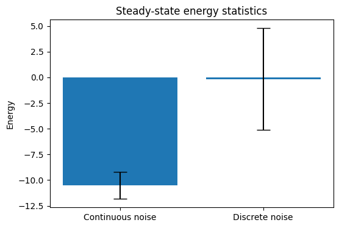
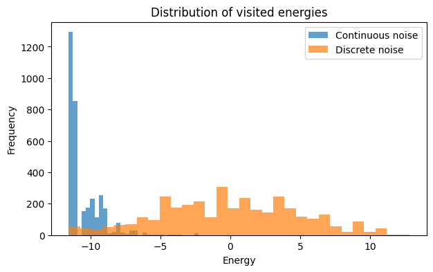
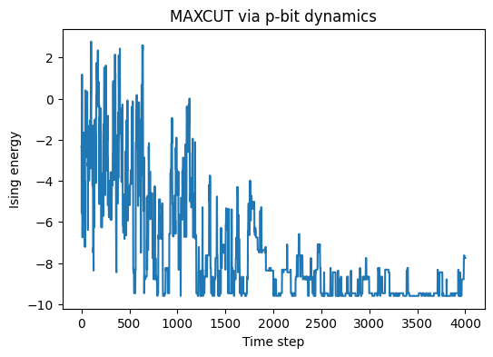
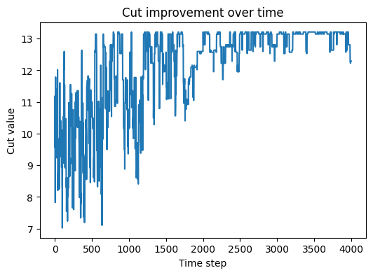

# Probabilistic p-bit Simulator and Optimization Experiments

This repository contains a software-based implementation of probabilistic bits (p-bits) and coupled p-bit circuits inspired by probabilistic spin logic and Ising machines.  
The project focuses on understanding how stochastic dynamics, noise statistics, and annealing affect convergence, energy landscapes, and optimization performance.

The entire framework is implemented from first principles in **PyTorch**, with an emphasis on interpretability rather than black-box learning.

---

## 🔬 Core Components

### 1. p-bit Model
- Binary stochastic units taking values in {−1, +1}
- Hyperbolic tangent nonlinearity
- Explicit noise injection
- Asynchronous updates

### 2. Coupled p-bit Circuit
- Fully connected Ising-style interactions
- Local fields computed dynamically
- Energy-based formulation:
  
E = -0.5 * m^T J m - h^T m

---

## 📊 Noise Statistics and Energy Landscapes

A systematic comparison was performed between **continuous** and **discrete** noise models:

- Continuous noise produces Boltzmann-like sampling
- Discrete noise leads to broader energy fluctuations
- Steady-state energy distributions differ significantly

### Observations:
- Continuous noise converges to lower average energy
- Discrete noise exhibits higher variance and poor selectivity
- Energy histograms reveal distinct sampling behavior

These results demonstrate that **noise statistics alone strongly influence p-bit dynamics**, even with identical couplings.

---

## 🔥 MAXCUT Optimization via p-bits

The p-bit circuit is applied to the **MAXCUT problem** by mapping graph weights to an Ising Hamiltonian:

J_ij = -w_ij

### Experiments include:
- Random weighted graphs
- Asynchronous p-bit updates
- Energy tracking
- Cut-value tracking
- Comparison with random baselines

---

## 🌡️ Annealing Schedules

To transition from sampling to optimization, a linear annealing schedule is introduced:

β(t): β_min → β_max

### Effects:
- Early exploration of the energy landscape
- Gradual freezing into low-energy configurations
- Improved convergence stability
- Consistent discovery of high-quality MAXCUT solutions within a single run

Annealing is shown to be essential for optimization performance.

---

## 📈 Key Results

- Continuous noise yields lower steady-state energies than discrete noise
- Annealed p-bit dynamics show clear energy descent over time
- MAXCUT cut values improve monotonically during annealing
- p-bit solvers reliably reach optimal or near-optimal cuts on small graphs

---

## 📁 File Overview

- `start.py`  
  Contains:
  - p-bit and p-circuit implementations
  - Noise analysis experiments
  - MAXCUT experiments with annealing
  - Visualization code

---

## 🚧 Project Status

This is an **ongoing research project**.  
Planned extensions include:
- Noise shaping (Gaussian vs uniform)
- Larger and harder MAXCUT instances
- Repeated-run statistics
- Additional optimization benchmarks

---

## 📌 Motivation

This project is intended as an exploratory study of probabilistic computing using p-bits, bridging ideas from:
- Stochastic neural systems
- Energy-based models
- Ising machines
- Combinatorial optimization

---

## 👤 Author

Ayush Pandey  
B.Tech Mathematics & Computing  
Rajiv Gandhi Institute of Petroleum Technology (RGIPT)
